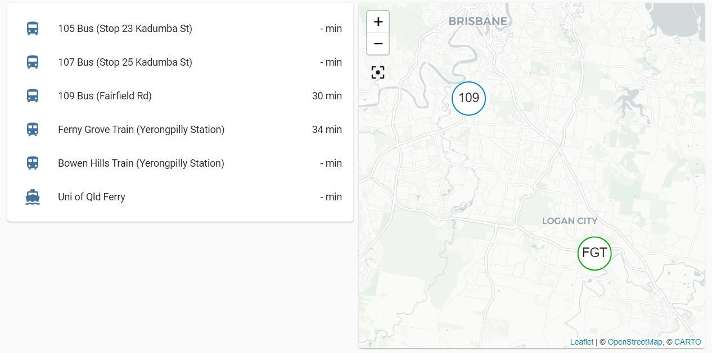

# Home Assistant GTFS RealTime (rt)

This project contains a new sensor that provides real-time departure data for
local transit systems that provide gtfs feeds.

It is based on the excellent work that has been done previously by @zacs and @phardy.  Originally inspired by a desire to make the existing code work with realtime data for trains and buses provided by Translink in Queensland, Australia (who have unique route ids for each route/calendar combination) this version also contains a number of other improvements. 

## Installation (HACS) - Recommended
0. Have [HACS](https://hacs.xyz/) installed, this will allow you to easily update
1. Add `https://github.com/mark1foley/ha-gtfs-rt-v2` as a [custom repository](https://hacs.xyz/docs/faq/custom_repositories/) as Type: Integration
2. Click install under "GTFS-Realtime", restart your instance.

## Installation (Manual)
1. Download this repository as a ZIP (green button, top right) and unzip the archive
2. Copy `/custom_components/gtfs_rt` to your `<config_dir>/custom_components/` directory
   * You will need to create the `custom_components` folder if it does not exist
   * On Hassio the final location will be `/config/custom_components/gtfs_rt`
   * On Hassbian the final location will be `/home/homeassistant/.homeassistant/custom_components/gtfs_rt`

## Configuration

Add the following to your `configuration.yaml` file:

```yaml
# Example entry for Queensland, Australia

sensor:
  - platform: gtfs_rt
    trip_update_url: 'https://gtfsrt.api.translink.com.au/api/realtime/SEQ/TripUpdates'
    vehicle_position_url: 'https://gtfsrt.api.translink.com.au/api/realtime/SEQ/VehiclePositions'
    route_delimiter: -
    departures:
    - name: Ferny Grove Train
      route: BNFG
      stopid: 600196
      icon: mdi:train
      service_type: Train
    - name: Uni Qld Ferry
      route: NHAM
      stopid: 319665
      icon: mdi:ferry
      service_type: Ferry
    - name: 1 0 7 Bus
      route: 107
      stopid: 4843
      icon: mdi:bus
      service_type: Bus
```

Configuration variables:

- **trip_update_url** (*Required*): Provides route etas. See the **Finding Feeds** section at the bottom of the page for more details on how to find these
- **update_frequency** (*Optional*): Frequency (in seconds) that updates occur.  Default is 60
- **vehicle_position_url** (*Optional*): Provides live position tracking on the home assistant map
- **api_key** (*Optional*): If provided, this key will be sent with API requests in an "Authorization" header.
- **x_api_key** (*Optional*): If provided, this key will be sent with API requests in an "x_api_key" header.
- **route_delimiter** (*Optional*): If provided, the text in the feed's route id before the delimiter is used as the route id.  Useful if the provider incorporates calendar ids into their route ids.
- **departures** (*Required*): A list of routes and departure locations to watch
- **name** (*Required*): The name of the sensor in HA.  When displaying on the map card HA generates the name using the first letters of the first 3 words.  So, 1<space>0<space>7<space>Bus shows as "107" on the map.  Different labels can be defined when displaying the sensor on an entiry card etc.
- **route** (*Required*): The name of the gtfs route (if route_delimiter is used, the text before the delimiter)
- **stopid** (*Required*): The stopid for the location you want etas for
- **icon** (*Optional*): The icon used in HA for the sensor (default is mdi:bus if non supplied)
- **service_type** (*Optional*): The name used when created the "Next <service type>" attribute for the sensor in HA.  For example, Next Bus, Next Ferry etc etc (default is "Next Service" if non supplied)

## Screenshot



## Finding Feeds

[Transit Feeds](https://transitfeeds.com) is a fairly good source for realtime
gtfs feeds. Search for your city, and then look for a feed that is tagged with
'GTFS-RealTime'. There should be an 'official url' in the side bar that you can
use. Routes and stops can be found by clicking on the regular gtfs feed, and
finding the id for the stop you are interested in. Please feel free to message
me or open an issue if you find other good sources.

GTFS providers should also publish a zip file containing static data, including route and stop information.  For example [Translink SEQ ZIP](https://gtfsrt.api.translink.com.au/GTFS/SEQ_GTFS.zip).  The route and stop ids you need to configure the realtime feed in HA are provided in this file.

## Reporting an Issue

1. Setup your logger to print debug messages for this component using:
```yaml
logger:
  default: info
  logs:
    custom_components.gtfs_rt: debug
```
2. Restart HA
3. Verify you're still having the issue
4. File an issue in this Github Repository containing your HA log (Developer section > Info > Load Full Home Assistant Log)
   * You can paste your log file at pastebin https://pastebin.com/ and submit a link.
   * Please include details about your setup (Pi, NUC, etc, docker?, HASSOS?)
   * The log file can also be found at `/<config_dir>/home-assistant.log`
